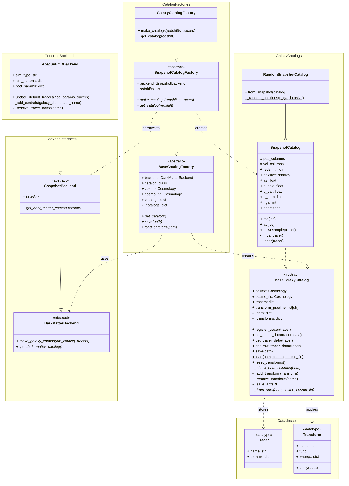

### UML Class diagram

```mermaid
classDiagram
    namespace Dataclasses {
        class Tracer {
            <<datatype>>
            + name: str
            + params: dict
        }
        class Transform {
            <<datatype>>
            + name: str
            + func
            + kwargs: dict
            + apply(data)
        }
    }

    namespace Backend Interfaces {
        class DarkMatterBackend {
            <<abstract>>
            + make_galaxy_catalog(dm_catalog, tracers)*
            + get_dark_matter_catalog()*
        }
        class SnapshotBackend {
            <<abstract>>
            + boxsize*
            + get_dark_matter_catalog(redshift)*
        }
    }
    SnapshotBackend --|> DarkMatterBackend

    namespace Concrete Backends {
        class AbacusHODBackend {
            + sim_type: str
            + sim_params: dict
            + hod_params: dict
            + update_default_tracers(hod_params, tracers)
            - _add_centrals(galaxy_dict, tracer_name)$
            - _resolve_tracer_name(name)
        }
    }
    AbacusHODBackend ..|> SnapshotBackend

    namespace Catalog Factories {
        class BaseCatalogFactory {
            <<abstract>>
            + backend: DarkMatterBackend
            + catalog_class
            + cosmo: Cosmology
            + cosmo_fid: Cosmology
            + catalogs: dict
            - _catalogs: dict
            + get_catalog()*
            + save(path)*
            + load_catalogs(path)*
        }
        class SnapshotCatalogFactory {
            <<abstract>>
            + backend: SnapshotBackend
            + redshifts: list
            + make_catalogs(redshifts, tracers)*
            + get_catalog(redshift)*
        }
        class GalaxyCatalogFactory {
            + make_catalogs(redshifts, tracers)
            + get_catalog(redshift)
        }
    }
    SnapshotCatalogFactory --|> BaseCatalogFactory
    GalaxyCatalogFactory ..|> SnapshotCatalogFactory

    namespace Galaxy Catalogs {
        class BaseGalaxyCatalog {
            <<abstract>>
            + cosmo: Cosmology
            + cosmo_fid: Cosmology
            + tracers: dict
            + transform_pipeline: list[str]
            - _data: dict
            - _transforms: dict
            + register_tracer(tracer)
            + set_tracer_data(tracer, data)
            + get_tracer_data(tracer)
            + get_raw_tracer_data(tracer)
            + save(path)
            + load(path, cosmo, cosmo_fid)$
            + reset_transforms()
            - _check_data_columns(data)*
            - _add_transform(transform)
            - _remove_transform(name)
            - _save_attrs(f)*
            - _from_attrs(attrs, cosmo, cosmo_fid)*
        }
        class SnapshotCatalog {
            # pos_columns
            # vel_columns
            + redshift: float
            + boxsize: ndarray
            + az: float
            + hubble: float
            + q_par: float
            + q_perp: float
            + ngal: int
            + nbar: float
            + rsd(los)
            + ap(los)
            + downsample(tracer)
            - _ngal(tracer)
            - _nbar(tracer)
        }
        class RandomSnapshotCatalog {
            + from_snapshot(catalog)$
            - _random_positions(n_gal, boxsize)$
        }
    }
    SnapshotCatalog ..|> BaseGalaxyCatalog
    RandomSnapshotCatalog --|> SnapshotCatalog

    %% Cross-namespace dependencies
    BaseCatalogFactory ..> DarkMatterBackend : uses
    BaseCatalogFactory ..> BaseGalaxyCatalog : creates
    SnapshotCatalogFactory ..> SnapshotBackend : narrows to
    SnapshotCatalogFactory ..> SnapshotCatalog : creates
    BaseGalaxyCatalog ..> Tracer : stores
    BaseGalaxyCatalog ..> Transform : applies
```