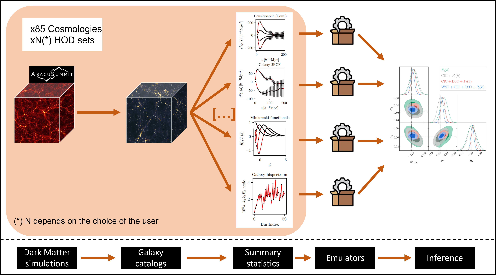

# Overview

The `acm` pipeline consists in five main steps that have to be executed separately. The pipeline is designed to be modular, so that each step can be run independently from the others. 

While the physics and data measurements are handled by the `acm` code, the more abstract components of the pipeline (e.g. the inference, the emulator, etc.) are handled by the [`sunbird`](https://github.com/florpi/sunbird) code.

:::{note}
Most of the pipeline is designed to run on the NERSC cluster, and some parts of it have hardcoded paths that are specific to the NERSC environment. (e.g. the paths to the dark matter catalogs in `AbacusHOD`, the paths to the precomputed models, etc.)
:::