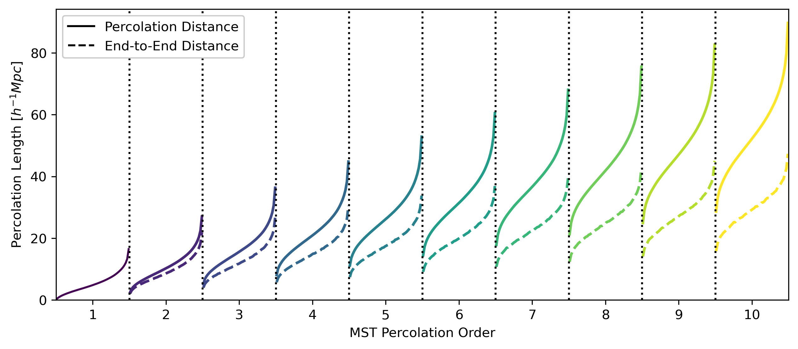

# Minimum Spanning Tree Statistics

The minimum spanning tree (MST), a graph constructed from a distribution of points, draws lines between pairs of points so that all points are linked in a single skeletal structure. The structure/tree contains no loops and the minimal possible total edge length.

## Overview

### The ``MinimumSpanningTree`` class

To `MinimumSpanningTree` class is imported from `acm.estimators.galaxy_clustering.mst`:
```python
from acm.estimators.galaxy_clustering.mst import MinimumSpanningTree
```
To initialise and setup the MST class
```python
mst = MinimumSpanningTree()
# Jitter dispersion scale, the point-process smoothing scale
sigmaJ = 3.
# Size of the box for the simulation data set
boxsize = 1000.
# Order of the maximum percolation statistics
Nthpoint = 10
# OPTIONAL: origin of the box.
origin = 0.
# OPTIONAL: Divide the box, to compute the MST in subboxes.
split = 1
# OPTIONAL: The number of iterations to marginalise over the stochasticity from the jitter dispersion.
iterations = 1
# OPTIONAL: The number of bins used for the MST distributions. 
quartiles = 50
# Setup MST
mst.setup(sigmaJ, boxsize, Nthpoint, origin=origin, split=split, iterations=iterations, quartiles=quartiles)
```
Compute the MST statistics with, where the positions are inputed as `pos` where `x=pos[:,0]`, `y=pos[:,1]` and `z=pos[:,2]`.
```python
mstdict = mst.get_percolation_statistics(pos)
```
Where `mstdict` is a dictionary containing the percolation statistics:
```python
mstdict['mst1pt'] # which gives the distribution of the MST edge lengths.
mstdict['mst2pt'] # which gives the distribution of 2 edges in the MST.
mstdict['end2pt'] # which gives the distribution of the distances between the end points of the associated 2 edges.
```
For the next N-points you can get the statistics for the `N`-th edge distributions using:
```python
mstdict['mst%ipt'%N]
mstdict['end%ipt'%N]
```
and to plot all the outputs:
```python
plot_percolation_statistics(mstdict)
```

